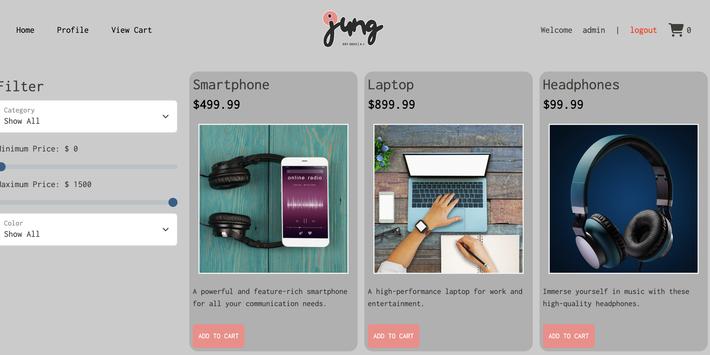

# Easy Shop E-Commerce Website (*in progress)
This project is an e-commerce application for jung, an up and coming store that sells a wide range of items.
#### Goal
- familiarize using SpringBoot API's with a MYSQL database.
- find and fix bugs before adding new features

### Progress

Implemented new methods on CategoriesController that enabled users to filter through the items.

I kept on getting error messages for one of my tests.

I was able to change the exception handling and get it to finally work. 

### Additional Coding

I decided to change the starter webste to suit more my brand. 

It took a lot of my time to get everything the way I wanted it to be.

I ended up running into some issues with the login feature, but eventually got it working.